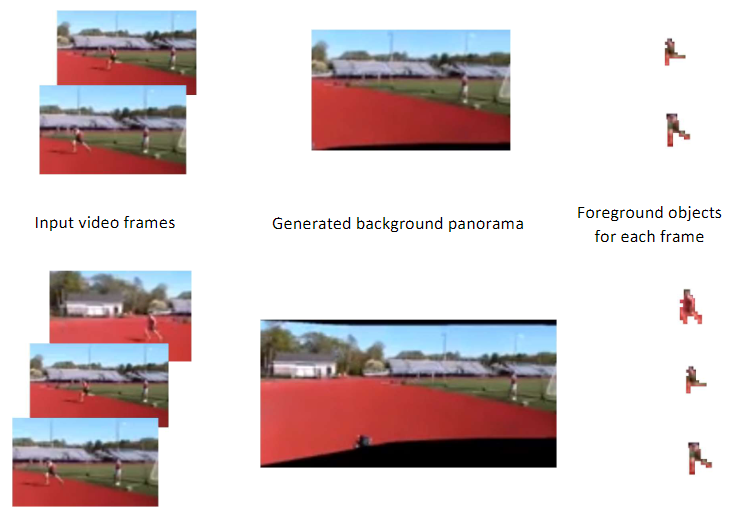
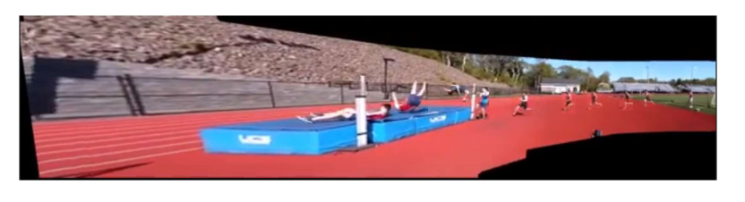
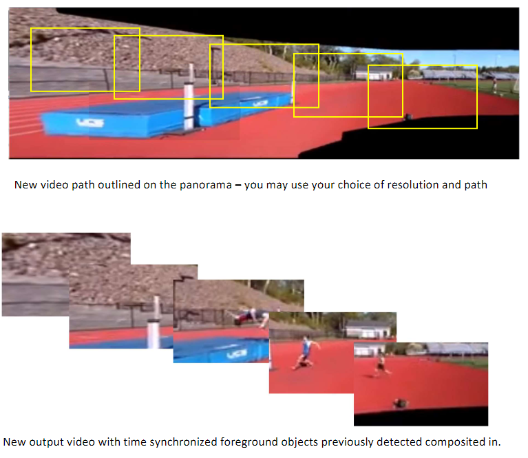

# Generating novel videos assisted by Background-Foreground Panorama Analysis

## Video
https://github.com/honghulu/Generating-novel-videos-with-Background-Foreground-Panorama-Analysis/assets/135955524/28453862-c8c0-42c9-a41d-72509b9ad6a7

https://github.com/honghulu/Generating-novel-videos-with-Background-Foreground-Panorama-Analysis/assets/135955524/7eb310a1-16bf-4984-b74c-2b7c7d8835e6

## Objective

Note: for src files, path changes are required
✔ means methods are considered or used

Files are omitted the following intermediate steps:

- extract foreground objects or segment humans using Resnet

- video/image inpainting foreground object, results in a set of pure background images

- stitching foreground and background frame images into panorama simultaneously

## Output 1

## Output 2

## Output 3

- it's trivial and from input images of output 2, since we use image inpainting techniques to produce output 2
